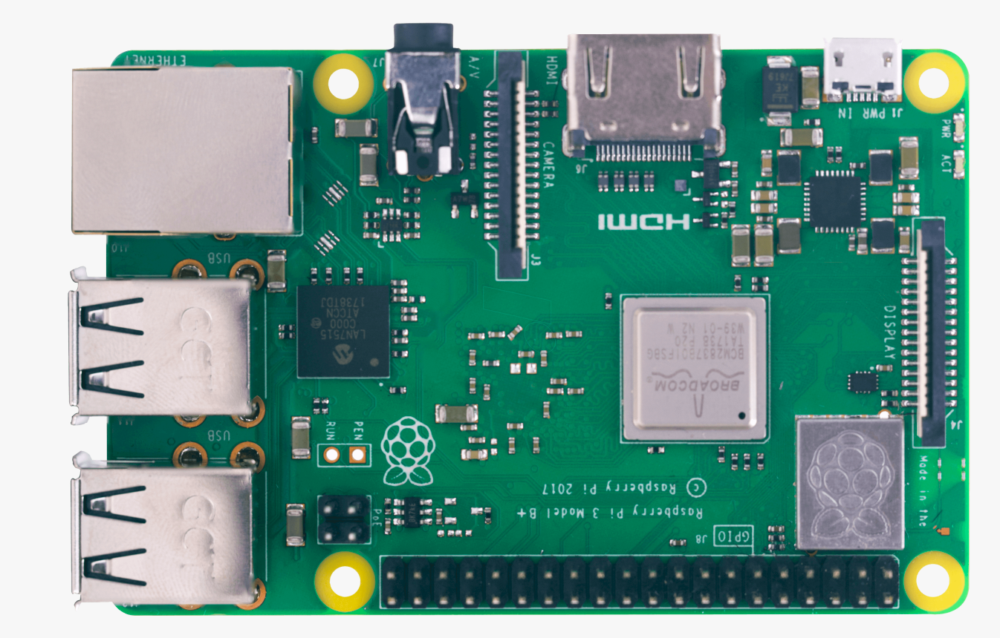

# all about Raspberry Pi

<!--ts-->
## မာတိကာ
   * အခန်း(၁)
   * မိတ်ဆက်
      * ၁.၁ Operating Systems
      * ၁.၁.၁ Raspbian image ရယူခြင်းနှင့် SHA checksums စစ်ဆေးခြင်း
      * ၁.၁.၂ SD card ပေါ်တွင် Raspbian image တပ်ဆင်ခြင်း
      * ၁.၁.၃ Command Line မှတဆင့် Raspbian image တပ်ဆင်ခြင်း
      * ၁.၂ Raspberry Pi အား Setup ပြုလုပ်ခြင်း
      * ၁.၃ SD card အား Gparted ဖြင့် format ချခြင်း
      * ၁.၄ CPU Temperature စစ်ဆေးခြင်း
      * ၁.၅ Raspbian OS အား PC တွင် အသုံးပြုခြင်း
      * ၁.၆ Nano Text Editor နှင့် သိမှတ်ဖွယ်ရာ အခြေခံ Command များ
   * အခန်း(၂)
   * Network ချိတ်ဆက်ခြင်း
      * ၂.၁ Wifi ချိတ်ဆက်ခြင်း
      * ၂.၂ Wired Network ချိတ်ဆက်ခြင်း
      * ၂.၃ IP Address စစ်ဆေးခြင်း
      * ၂.၄ Static IP Address သတ်မှတ်ခြင်း
      * ၂.၅ Raspberry Pi Network Name ကို ပြုပြင်ခြင်း
      * ၂.၆ SSH ဖြင့် ချိတ်ဆက် အသုံးပြုခြင်း
      * ၂.၇ VNC ဖြင့် ဆက်သွယ်ခြင်း
      * ၂.၈ SFTP ဖြင့် ဖိုင်များ ပေးပို့ရယူခြင်း
      * ၂.၉ NAS Server တည်ဆောက်ခြင်း
      * ၂.၁၀ Sublime Text အား SSH ပေါ်မှတဆင့် ချိတ်ဆက် အသုံးပြုခြင်း
   * အခန်း(၃)
   * GPIO အခြေခံများ
      * ၃.၁ sysfs Mode ဖြင့် GPIO များအား ထိန်းချုပ်ခြင်း
      * ၃.၁.၁ sysfs interface အား Python တွင် အသုံးပြုခြင်း
      * ၃.၂ WiringPi Library သုံး၍ GPIO များအား ထိန်းချုပ်ခြင်း
      * ၃.၂.၁ wiringPi pinMode setup အား Python တွင် အသုံးပြုခြင်း
      * ၃.၂.၂ BCM pinMode setup အား Python တွင် အသုံးပြုခြင်း
      * ၃.၂.၃ Digital Input တန်ဖိုးများ ဖတ်ခြင်း
      * ၃.၂.၄ wiringPi GPIO command များအား Terminal တွင် အသုံးပြုခြင်း
      * ၃.၃ Bash Script File တွင် GPIO command များ အသုံးပြုခြင်း
      * ၃.၄ RPi.GPIO Library သုံး၍ GPIO များအား ထိန်းချုပ်ခြင်း
      * ၃.၄.၁ Digital Input/Output စမ်းသပ်ခြင်း
      * ၃.၄.၂ PWM Output ထုတ်ခြင်း
      * ၃.၅ Safe Shutdown Button တပ်ဆင်ခြင်း
   * အခန်း(၄)
   * Hardware များနှင့် ချိတ်ဆက်ခြင်း
      * ၄.၁ Relay အသုံးပြုခြင်း
      * ၄.၂ TIP122 ဖြင့် High Power DC Device များအား ထိန်းချုပ်ခြင်း
      * ၄.၃ 4x4 Matrix Keypad အသုံးပြုခြင်း
      * ၄.၄ L298N Motor Driver အသုံးပြုခြင်း
      * ၄.၅ Line Follower Robot ပြုလုပ်ခြင်း
      * ၄.၆ Servo Motor အသုံးပြုခြင်း
   * အခန်း(၅)
   * Communication Interface များ
      * ၅.၁ UART အသုံးပြုခြင်း
      * ၅.၁.၁ Arduino နှင့် UART အသုံးပြု ဆက်သွယ်ခြင်း
      * ၅.၁.၂ SIM900A GSM Module အသုံးပြုခြင်း
      * ၅.၂ SPI အသုံးပြုခြင်း
      * ၅.၂.၁ Arduino နှင့် SPI အသုံးပြု ဆက်သွယ်ခြင်း
      * ၅.၂.၂ MCP3008 ADC IC အသုံးပြုခြင်း
      * ၅.၂.၃ SPI နှင့် UART ၂ခု တွဲဖက်အသုံးပြုခြင်း
      * ၅.၃ I2C အသုံးပြုခြင်း
      * ၅.၃.၁ Arduino နှင့် I2C အသုံးပြု ဆက်သွယ်ခြင်း
      * ၅.၃.၂ PCA9685 Servo Driver အသုံးပြုခြင်း
   * အခန်း(၆)
   * Display များ အသုံးပြုခြင်း
      * ၆.၁ LCD (Liquid Crystal Display)  အသုံးပြုခြင်း
      * ၆.၁.၁ I2C Expander Module တပ်ဆင်အသုံးပြုခြင်း
      * ၆.၂ OLED (Organic Light Emitting Diode) Display အသုံးပြုခြင်း
      * ၆.၂.၁ I2C interface OLED display အသုံးပြုခြင်း
      * ၆.၂.၂ SPI interface OLED display အသုံးပြုခြင်း
      * ၆.၃ E-Paper, E-Ink Display အသုံးပြုခြင်း
   * အခန်း(၇)
   * Sensor များ အသုံးပြုခြင်း
      * ၇.၁ DHT11 Temperature and Humidity Sensor
      * ၇.၂ DS18B20 1-Wire Temperature Sensor
      * ၇.၃ RC522 RFID Card Sensor Module
      * ၇.၄ TCS3200 Color Sensor
      * ၇.၅ HC-SR04 Ultrasonic Distance Sensor
      * ၇.၆ Rotary Encoder
   * အခန်း(၈)
   * Web Server တည်ဆောက်ခြင်း
      * ၈.၁ Apache Web Server တည်ဆောက်ခြင်း
      * ၈.၁.၁ HTML, CSS, Javascript
      * ၈.၁.၂ CGI (Common Gateway Interface)
      * ၈.၁.၃ Apache Directory Setting
      * ၈.၁.၄ LED မီး အဖွင့်အပိတ် ပြုလုပ်ခြင်း
      * ၈.၁.၅ Python ဖြင့် CGI script ရေးသားခြင်း
      * ၈.၂ Nginx Web Server တည်ဆောက်ခြင်း
   * အခန်း(၉)
   * IoT (Internet of Things)
      * ၉.၁ Thingspeak IoT Platform
      * ၉.၂ Remote.it
   * အခန်း(၁၀)
   * Bluetooth ချိတ်ဆက်အသုံးပြုခြင်း
      * ၁၀.၁ Pair and Connect ပြုလုပ်ခြင်း
      * ၁၀.၂ လိုအပ်သော Extension Module Package များ ထည့်သွင်းခြင်း
      * ၁၀.၃ Python တွင် RFCOMM ဖြင့် ချိတ်ဆက်အသုံးပြုခြင်း
      * ၁၀.၄ Python တွင် L2CAP  ဖြင့် ချိတ်ဆက်အသုံးပြုခြင်း
      * ၁၀.၅ Service Discovery Protocol (SDP) အသုံးပြုခြင်း
      * ၁၀.၆ Bluetooth Audio Streaming ပြုလုပ်ခြင်း
      * ၁၀.၇ Bluetooth Based Wireless Sensor Network တစ်ခု ပြုလုပ်ခြင်း
      * ၁၀.၈ Arduino နှင့် ချိတ်ဆက်ပြီး Bluetooth Control Robot ပြုလုပ်ခြင်း
   * အခန်း(၁၁)
   * Camera အသုံးပြုခြင်း
      * ၁၁.၁ Camera အား Python ဖြင့် အသုံးပြုခြင်း
      * ၁၁.၂ Raspberry Pi Camera Web Interface
      * ၁၁.၃ OpenCV (Open Source Computer Vision)
      * ၁၁.၃.၁ OpenCV install ပြုလုပ်ခြင်း
      * ၁၁.၃.၂ Face, Eye, Nose, Smile Detection
      * ၁၁.၃.၃ Detection from Streaming Video
      * ၁၁.၃.၄ Detection from Still Image
<!--te-->
